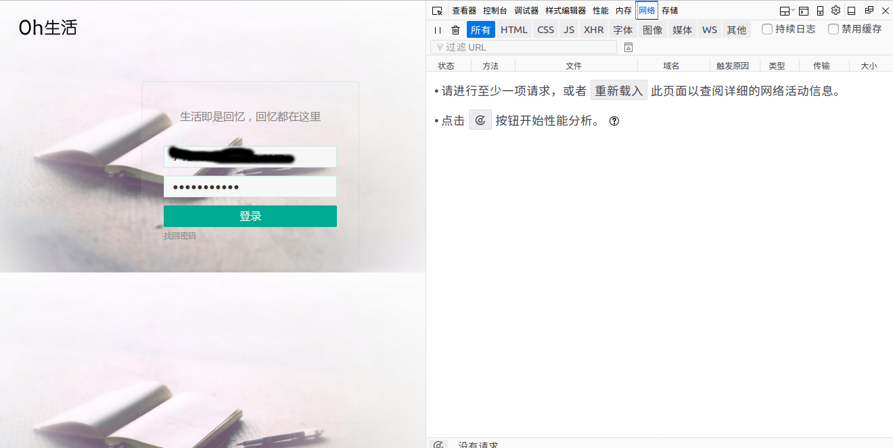
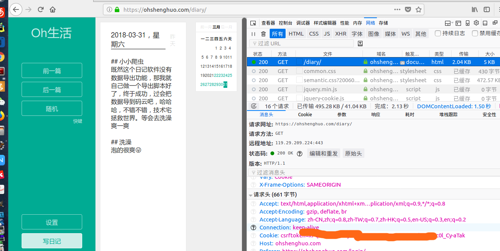
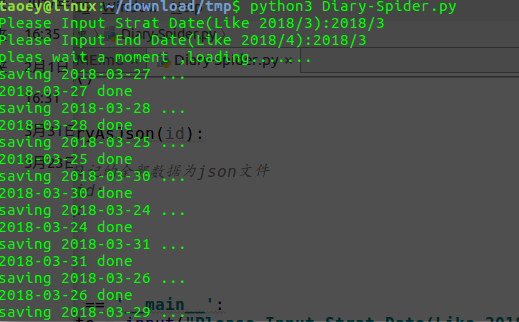

# Oh-生活-日记爬虫

## 功能描述
[Oh-生活](https://ohshenghuo.com/)是一款在线的笔记，这款笔记的移动端和《你的名字》中的笔记很像，因此入坑
但是里面的数据不支持导出啊，作为一个有强迫症的程序员，我实在受不了。因此我利用简单的python requests模块模拟登录进行数据的提取

## 使用方法
### 安装python3.6
推荐博客：[Python3入门笔记（1） —— windows安装与运行](https://www.cnblogs.com/weven/p/7252917.html)

### 获取headers
在浏览器(推荐使用火狐)的登录界面按F12,调出web开发者管理界面，点击“网络”，然后进行登录操作，在“网络”中会有一个“/diary/”的文件，把其中的请求头拷贝到“headers.txt”文件中

### 下载脚本文件
[脚本下载](https://github.com/Taoey/MyScrapy/files/1866210/Diary-Spider.zip)，下载脚本后解压得到Diary-Spider.py 文件

- 双击解压好的.py 脚本即可

